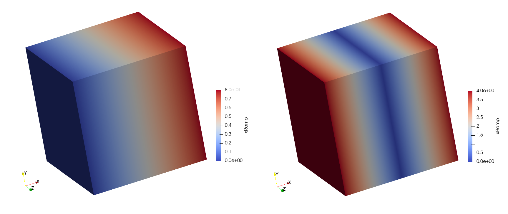

# Abstract

With increasing computing resources, investigating uncertainties in simulation results is becoming an increasingly important factor. Hereby, a deterministic simulation is computed several times with different deviations of the input parameters to produce a variety of outputs of the same model to analyze those effects. The relevant stochastic or parametric output variables, such as mean, expected value, and variance, are often calculated and visualized only at selected individual points of the whole domain. This project aims to provide a simple way to perform stochastic or parametric post-processing of simulations results on entire domains using the VTK unstructured grid (VTU) file system [@schroeder2006visualization] and the Julia language [@bezanson2012julia] as an example. The VTU file format is primarily used in conjunction with [Paraview](https://www.paraview.org/), an open-source, multi-platform data analysis and visualization tool, to display results of, e.g., structural or fluid mechanics simulations.

# Statement of need

To the authors knowledge, there is no library available, neither for the VTU result file-format nor any other simulation result file-format, which standardizes stochastic/parametric post-processing. To this date, this kind of \textit{meta} post-processing seems to be done by purely proprietary means. With this novel approach, stoachastic properties can be displayed on the whole domain using well established visualization software.

# State of the field

There are other approaches to writing and reading VTU, or more generally VTK, files available in the Julia community. [WriteVTK.jl](https://github.com/jipolanco/WriteVTK.jl) is a package for the creation of VTK XML files from julia out of data already available in system memory. [ReadVTK.jl](https://github.com/trixi-framework/ReadVTK.jl) is a project primarily dedicated to read data written by WriteVTK.jl. Neither of those packages explicitly addresses reading, writing and manipulating generic VTU files. However, an advanced [VTK Python Wrapper](https://github.com/Kitware/VTK/tree/master/Wrapping/Python) does exist. 

# Introduction

The [Visualization Toolkit](https://vtk.org/) (VTK) is an open source software project for manipulating and displaying scientific data. It supports a variety of visualization algorithms and advanced modeling techniques such as implicit modeling and mesh smoothing. It defines three types of file formats: a legacy format, a XML format and a HDF file format. Since the HDF file format is fairly new, the XML file format is the most used so far and will be also used here. VTK datasets are classified into one of two categories: structured (tensor grids, image data) and unstructured (meshes). We will restrict ourselves to unstructed datasets in the following since modern simulation results are often times performed on complex geometries. Simulation results saved as VTU file can be displayed and investiged with the Paraview application.

[Julia](https://julialang.org/) is a fast and dynamic programming language which enables fast prototyping as well as efficiently implemented software solutions. With its in built features for numerical mathematics and distributed computing, it very well suited for implementing computational physics. However, since Julia is a newer programming language, it often time lacks the native connections to other software projects or industry standards that exist in Python, for example.

The software presented here should make it possible to read in, manipulate and write out existing VTU files.

# Motivation

Consider a discrete computational model $\mathcal{M}$, providing a generic output $\mathbf{Y}$ for a given set of inputs $\mathbf{X}$:
\begin{equation}\label{eq:discr}
\mathbf{Y} = \mathcal{M}(\mathbf{X})\;.
\end{equation}
For example, the output $\mathbf{Y}$ can be a scalar, a vector, a matrix, or a finite-element post-processing result. In this case, we consider the output to be a VTU file. The input parameters are considered a set of scalars $\mathbf{X}= \{X_1,...,X_N\}$, and for simplicity, the set is reduced to a \textit{singleton} ($N=1$). Equation (\ref{eq:discr}) is called the \textit{deterministic case}. As a next step, we introduce a parametric variation $\mathbf{X}:=\mathbf{X}(\boldsymbol{\xi})$, where $\boldsymbol{\xi}$ maps the inputs from a minimum to a maximum value. We refer to this problem formulation as the \textit{parametric} (or if $\xi_i$, $i\in{1,...,N}$ is a random variable with a probability  density function, \textit{stochastic} ) \textit{case}:
\begin{equation}\label{eq:stoch}
\mathbf{Y}(\boldsymbol{\xi}) = \mathcal{M}(\mathbf{X}(\boldsymbol{\xi}))\;.
\end{equation}
Since $\mathcal{M}(\mathbf{X}(\boldsymbol{\xi}))$ is no longer deterministic, further methods are required to discretize the \textit{sample space} and to post-process and visualize the results. Different methods for uncertainty quantification can be found in @gates2015multilevel or @sudret2017surrogate, for example.
The most prominent method for computing the expected value of the problem described in Equation (\ref{eq:stoch}) is the Monte-Carlo method:
\begin{equation}\label{eq:montecarlo}
\mathbb{E}[\mathbf{Y}(\boldsymbol{\xi})] \approx \tilde{\mathbb{E}}[\mathcal{M}(\mathbf{X}(\boldsymbol{\xi}))] = \frac{1}{M} \sum\limits_{i=1}^M \mathcal{M}(\mathbf{X}(\tilde{\boldsymbol{\xi}}_i))\,,\quad
\tilde{\xi}_{ij} \sim \mathcal{U}(0,1)\,.
\end{equation} 
From (\ref{eq:montecarlo}) we can conlcude that if $\mathbf{Y}(\tilde{\boldsymbol{\xi}}_i)=\mathcal{M}(\mathbf{X}(\tilde{\boldsymbol{\xi}}_i))$ is a deterministic VTU result file at position $\tilde{\boldsymbol{\xi}}_i$ in the sample space, it is sufficient to implement the operators `+(::VTUFile,::VTUFile)` and `/(::VTUFile,::Number)` to compute the expected value on the entire domain by help of the Monte-Carlo method.

# Definition of a VTUFile algebra

Let $V=(\text{VTUFile},+,*)$ be a field and $A \subseteq R^n$ a vector space over $V$. Then $V$ is an algebra if for all $x,y,z \in A$ and $a,b \in V$ the following holds:
\begin{equation}
(x+y) * z = x * z + y * z\\
z * (x+y) = z * x + z * y\\
(ax) * (bx) = (ab)(x * y)\\
\end{equation}

# Preliminaries 

The [VTUFileHandler](https://github.com/baxmittens/VTUFileHandler.jl) will eventually be used to perform stochastic post-processing on large VTU result files. Therefore, the following assumptions have to be fulfilled for the software to work correctly:

1. The VTU file must be in binary format and, in addition, can be Zlib compressed.
2. Operators can only be applied to VTU files that share the same topology. The user must ensure that this condition is met.
3. The data type of numerical fields of the VTU file, for which operators should be applied, have to be `Float64`.

# Features
The VTUFileHandler implements a basic VTU reader and writer through the functions:
```julia
function VTUFile(file::String) ... end 
function Base.write(vtu::VTUFile, add_timestamp=true) ... end
```
By default, a timestamp is added if VTU files are written to disk not to overwrite existing files. Only data fields that are registered by the function 
```julia
function set_uncompress_keywords(uk::Vector{String}) ... end
```
before reading the VTU file are uncompressed and can be altered. For applying math operators onto a data field, the associated field has to be registered by the function 
```julia
function set_interpolation_keywords(ik::Vector{String}) ... end
```
The following math operators acting point-wise on nodal results (point data) are implemented:
```julia 
+(::VTUFile, ::VTUFile),+(::VTUFile, ::Number),
-(::VTUFile, ::VTUFile),-(::VTUFile, ::Number),
*(::VTUFile, ::VTUFile),*(::VTUFile, ::Number),
/(::VTUFile, ::VTUFile),/(::VTUFile, ::Number),
^(::VTUFile, ::Number)
```
In-place variations of the operators above are implemented as well.

# Example

A three-dimensional cube with dimension $(x,y,z)$ with $0\leq x,y,z \leq 2$ discretized by quadratic hexahedral elements with 27 points and 8 cells named `vox8.vtu` with a linear ramp in x-direction ($f(x=0,y,z)=0$, $f(x=2,y,z)=0.8$) as a result field termed `xramp` will be used as an example (see \autoref{fig:1}). The following set of instructions transforms the result field from a linear ramp to a quadratic function in $x$-direction (displayed as a piecewise linear field due to the discretization):
```julia
set_uncompress_keywords(["xRamp"]) # uncrompress data field xramp
set_interpolation_keywords(["xRamp"]) # apply math operators to xramp
vtu = VTUFile("vox8.vtu"); # read the vtu
vtu += vtu/4; # [0.0,...,0.8] -> [0.0,...,1.0]
vtu *= 4.0; # [0,...,1.0] -> [0.0,...,4.0]
vtu -= 2.0; # [0,...,4.0] -> [-2.0,...,2.0]
vtu ^= 2.0; # [-2.0,...,2.0] -> [4.0,...,0.0,...,4.0]
```
The initial field and the resultant field of the above operations are displayed in figure \autoref{fig:1}.

{ width=100% }

# Conclusion

A basic VTU library was implemented, which does not claim completeness in terms of VTU features. However, the implemented math operators constitute a complete feature set sufficient to compute a complete parametric or stochastic post-processing of VTU files. This implementation can readily be used for this purpose or can be utilized as a template for extending a different VTU library.
The quantification of uncertainties in coupled thermo-hydro-mechanical simulations can serve as an example of an application where this tool together with [ogs6py](https://github.com/joergbuchwald/ogs6py) and [OpenGeoSys](https://www.opengeosys.org/) [@buchwald2021ogs6py] 
can be used to fully automate stochastic computations.

# References
